Here is the complete, updated **Project Proposal** formatted in Markdown.

I have integrated all the changes we discussed:

* **New Title:** *The Competency Alignment Validator*
* **Updated Diagram:** The version with the Sidebar logic.
* **Refined Architecture:** Including the specific Tech Stack (React, LangChain, Railway/Vercel).
* **Cleaned Up Flow:** Removed the duplicate image issue.

You can copy this entire block into a `.md` file or convert it directly to PDF/Word for submission.

---

# Project Proposal

**Project Title:** Poly-to-Pro (P2P): The Competency Alignment Validator
**Student Name:** Sim Chung Boon Larry
**Student ID:** 1123179E
**Track:** Application Development
**Module:** ITI123 Generative AI & Deep Learning
**Submission Date:** 28 Dec 2025

---

## 1. Executive Summary

**Poly-to-Pro (P2P)** is a specialized Generative AI application designed to bridge the "Articulation Gap" between Singapore’s Polytechnic graduates and corporate hiring expectations. While graduates often possess strong technical skills, they lack the vocabulary to map their experiences to official industry frameworks or the structural discipline to navigate behavioral interviews.

Unlike generic chatbot wrappers, P2P acts as a **Competency Validator**. It utilizes a **Hybrid Retrieval-Augmented Generation (RAG)** architecture grounded in the official **Singapore SkillsFuture Framework**.

The system features a novel **Dual-Agent Architecture**:

1. **The Hiring Manager Agent (Validator):** Audits technical competencies against government data.
2. **The Career Coach Agent (Strategist):** Refines behavioral delivery using the STAR methodology.

This adversarial feedback loop ensures graduates receive data-driven, accurate, and culturally aligned career advice.

---

## 2. Problem Statement

The "Underemployment" of fresh graduates often stems from an inability to articulate value, not a lack of skill.

1. **The Keyword Mismatch:** A student might describe a project as *"checking the numbers,"* failing to match the Industry Standard term *"Financial Reconciliation"* required by Applicant Tracking Systems (ATS).
2. **The Structure Deficit:** Graduates often ramble during behavioral questions (e.g., "Tell me about a time you failed"), missing the logical flow required to persuade interviewers.

**Target Audience:** Final-year Polytechnic students entering the workforce.
**Key Constraint:** The solution must be grounded in Singapore's context (SkillsFuture) to be practically useful.

---

## 3. Method & System Architecture

### 3.1 Overall Architectural Approach

This project implements a **Hybrid RAG** system wrapped in a responsive Single-Page Application (SPA). The architecture is designed to be **LLM-agnostic**, prioritizing robust prompt orchestration over dependency on a single model provider.

**Technical Stack:**

* **Frontend:** **React.js** with Tailwind CSS (Deployed on Vercel) for a responsive "Dashboard" experience.
* **Backend/Orchestration:** **Python (FastAPI)** and **LangChain** (Deployed on Railway) to manage the sequential logic.
* **Data Layer:**
* **Vector Store:** **ChromaDB** stores the SkillsFuture Competency Map for semantic retrieval.
* **Context Engine:** A session-based state manager that holds the user’s Resume data.

### 3.2 The "Context Engine" (Sidebar Logic)

Unlike standard chatbots that lose context as the conversation scrolls, P2P utilizes a **Persistent Sidebar** on the left interface. This component:

1. **Parses Resumes:** Extracts key skills from uploaded PDFs.
2. **Anchors the Role:** Locks the "Target Role" (e.g., Audit Associate) as a global variable, ensuring that every subsequent query is validated against the specific SkillsFuture requirements for that job.

### 3.3 Visual Architecture Diagram

The following diagram illustrates how the **Sidebar (Context)** injects data into the **Main Simulator Flow**:

```mermaid
graph LR
    %% GLOBAL STYLES
    classDef sidebarContainer fill:#0f172a,stroke:#334155,color:#fff
    classDef sidebarItem fill:#1e293b,stroke:#475569,color:#cbd5e1,stroke-width:1px
    classDef mainContainer fill:#f8fafc,stroke:#e2e8f0,color:#334155
    classDef stepContainer fill:#ffffff,stroke:#cbd5e1,stroke-width:1px,color:#334155
    classDef btnAction fill:#0f172a,stroke:#000,color:#fff,stroke-width:2px
    classDef goldResult fill:#fffbeb,stroke:#f59e0b,color:#78350f,stroke-width:3px

    %% LEFT PANEL: CONTEXT ENGINE
    subgraph SIDEBAR_PANEL [▐ LEFT PANEL: Context Engine]
        direction TB
        UPLOAD[/"📂 1. UPLOAD RESUME\n(Parses PDF for Skills)"/]
        ROLE[/"🎯 2. TARGET ROLE\n(Sets CSV Keywords)"/]
        STATS["📊 3. SESSION STATS\n(Gamification Score)"]
        UPLOAD --> ROLE --> STATS
    end

    %% RIGHT PANEL: THE SIMULATOR
    subgraph MAIN_PANEL [▐ RIGHT PANEL: The Simulator Flow]
        direction TB
        
        %% STEP 1
        subgraph S1 [Step 1: Set Scenario]
            DROPDOWN["🔽 Dropdown: Top Questions"]
            OR_DIV{-- OR --}
            CUSTOM["✍️ Input: Custom Question"]
            DROPDOWN --> OR_DIV
            CUSTOM --> OR_DIV
        end

        %% STEP 2
        subgraph S2 [Step 2: Student Action]
            ANSWER["📝 Input: Student Answer"]
            BTN_ANALYZE["🚀 BUTTON: Analyze My Answer"]
            ANSWER --> BTN_ANALYZE
        end

        %% STEP 3
        subgraph S3 [Step 3: Dual-Agent Feedback]
            direction TB
            subgraph AGENTS [Parallel Analysis]
                MGR["😠 Agent A (Manager)\nCritique: Missing Keywords"]
                COACH["🤓 Agent B (Coach)\nCritique: Structure (STAR)"]
            end
            FINAL_ADVICE["🏆 FINAL ADVICE\n(Optimized Model Answer)"]
            MGR --> FINAL_ADVICE
            COACH --> FINAL_ADVICE
        end
    end

    %% LOGIC CONNECTIONS
    OR_DIV --> ANSWER
    BTN_ANALYZE -.->|Processing| AGENTS
    
    %% CONTEXT INJECTION
    UPLOAD -.->|Injects Resume Data| BTN_ANALYZE
    ROLE -.->|Injects Role Criteria| BTN_ANALYZE

    %% STYLING APPLICATION
    class SIDEBAR_PANEL sidebarContainer
    class UPLOAD,ROLE,STATS sidebarItem
    class MAIN_PANEL mainContainer
    class S1,S2,S3 stepContainer
    class BTN_ANALYZE btnAction
    class FINAL_ADVICE goldResult

```

### 3.4 The Dual-Agent Logic

The core processing is handled by two specialized agents operating sequentially:

1. **Agent A: The Hiring Manager (Technical Auditor)**
* *Mechanism:* Performs a semantic search against the SkillsFuture CSV data.
* *Constraint:* If the user’s answer misses a "Critical Core Skill" defined for the selected role, Agent A flags it immediately (e.g., "You mentioned 'checking money', but the required term is 'Reconciliation'").

2. **Agent B: The Career Coach (Behavioral Strategist)**
* *Mechanism:* Uses a "Rule-Based Context Injection" approach. The system prompt contains the strict rules of the **STAR Method** (Situation, Task, Action, Result).
* *Constraint:* Restricted from inventing new experiences; it may only restructure the facts found in the user’s draft or resume.

---

## 4. User Interaction Flow

The application follows a linear, three-step user journey:

1. **Context Setup:** The user uploads their resume and selects a role (Sidebar).
2. **Scenario Selection:** The user selects a difficult question from the "Top 10" dropdown or types their own.
3. **Simulation:** The user types their draft answer.
4. **Feedback Loop:** The system displays:
* A **Red Card** (Manager Critique)
* A **Green Card** (Coach Advice)
* A **Golden Card** (The Model Answer)

---

## 5. Dataset & Prior Research

* **Primary Dataset:** **Singapore SkillsFuture Skills Framework (SSG)**. This authoritative CSV dataset defines the competency maps for various job roles.
* **Methodology:** The dataset is pre-processed into a Vector Store (ChromaDB) to allow Agent A to perform "Similarity Search" between the student's answer and the official job requirements.

---

## 6. Evaluation Plan

The system will be validated through a three-tiered evaluation framework:

1. **Retrieval Accuracy (Quantitative):** Verify that Agent A correctly maps Job Roles to Government Skills data. Target: >90% Precision.
2. **Hallucination Control (Qualitative):** Create a "Bad Resume" missing key skills. Success is defined if the system correctly REJECTS the candidate and explicitly identifies the missing skill.
3. **Latency Performance:** Ensure the full Dual-Agent chain completes generation in <8 seconds to maintain user engagement.

---

## 7. Responsible AI & Governance

* **Explainability:** The UI features a "Thinking..." state that visualizes which agent is currently speaking, ensuring the user understands *why* they are receiving specific feedback.
* **Hallucination Prevention:** Agent B is programmatically constrained to never invent facts. It utilizes a `temperature=0.2` setting to ensure determinism.
* **Bias Mitigation:** By separating the "Technical" and "Behavioral" critiques, the system avoids the "Halo Effect" where a confident speaker is judged as competent despite lacking technical skills.

---

## 8. Project Timeline (6 Weeks)

* **Week 1:** Repo setup & Pre-processing SkillsFuture CSV data.
* **Week 2:** Implement Agent A (Vector Retrieval Pipeline).
* **Week 3:** Implement Agent B (LangChain Sequence) & Sidebar Context Logic.
* **Week 4:** Frontend Development (React Dashboard).
* **Week 5:** Deployment (Railway/Vercel) & Evaluation Experiments.
* **Week 6:** Final Report & Video Presentation.